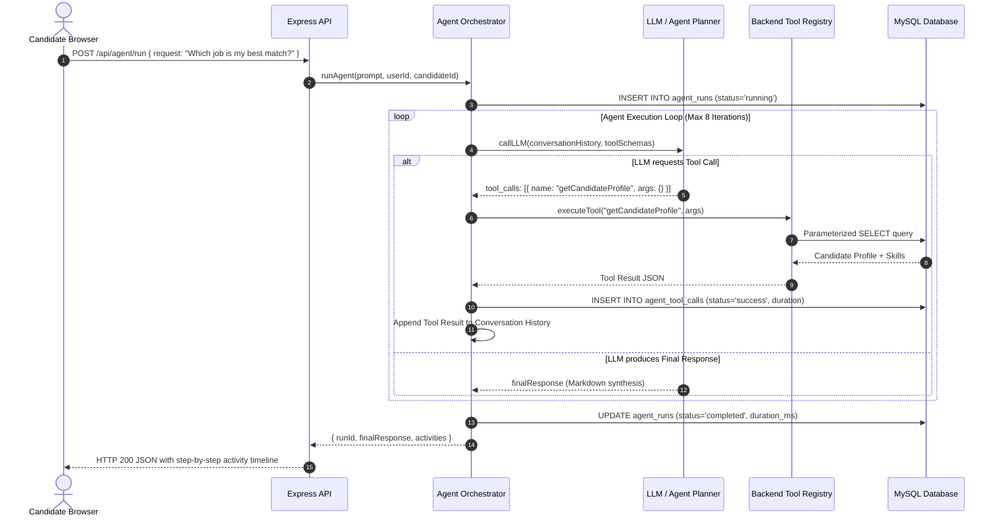
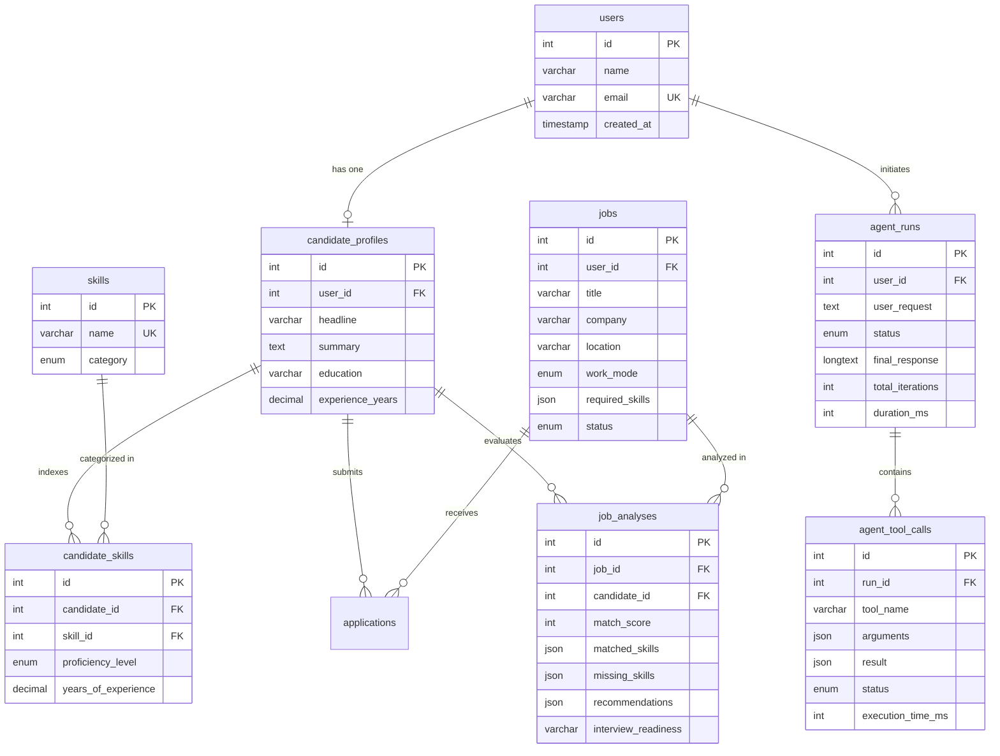

# 🚀 CAREERPILOT — AI CAREER AGENT
> **Autonomous AI Career Agent for Job Match Analysis, Skill Gap Remediation, and Tailored Interview Preparation**

[](https://nodejs.org/)
[](https://www.mysql.com/)
[]()
[]()
[](LICENSE)

---

## 📌 1. Project Overview

**CareerPilot** is an autonomous AI career agent designed to help job seekers evaluate job opportunities, calculate algorithmic skill match scores, identify critical skill gaps, and generate role-specific interview preparation strategies.

Unlike standard conversational chatbots that simply echo text back and forth, **CareerPilot implements a real multi-step agent orchestration loop using tool/function calling**. The agent receives a natural-language goal from the user, dynamically inspects registered backend tools, executes parameterized database queries and match algorithms against a normalized MySQL database, and iterates until it produces a verified, data-backed answer.

---

## 💡 2. Problem Statement & Why This Project Exists

In modern technical hiring, job descriptions are often overloaded with disparate skill requirements, creating anxiety and ambiguity for candidates:
1. **Subjective Self-Assessment**: Candidates struggle to quantify how well their skills match specific job listings.
2. **Generic Interview Preparation**: Standard practice questions fail to account for the specific intersection between the candidate's actual background and the target company's job requirements.
3. **Superficial "Chatbot" Solutions**: Typical AI demos send a candidate's resume straight to an LLM prompt without ground-truth database validation, leading to hallucinations, ungrounded match percentages, and zero persistence.

**CareerPilot solves this** by acting as an autonomous orchestrator. The AI agent never touches the database directly; instead, it utilizes **controlled backend tools** to inspect real candidate skills, analyze saved jobs, compute deterministic match percentages, persist evaluations in MySQL, and craft grounded interview talking points.

---

## ✨ 3. Core Features

- **Autonomous Agent Studio**: Conversational interface supporting complex prompts such as:
  > *"Analyze my saved jobs and tell me which job is the best match for my skills. Then prepare interview questions for the best matching job."*
- **Live Tool Execution Stepper**: Visual real-time timeline (`✓ Retrieved candidate profile`, `✓ Retrieved 6 saved jobs`, `✓ Calculated candidate-job match`, `✓ Generated interview questions`, `✓ Saved analysis to database`).
- **Normalized MySQL Persistence**: Full relational schema storing users, candidate profiles, master skills taxonomy, candidate proficiencies, jobs, applications, job analyses, and fine-grained agent execution audit logs.
- **8 Controlled Backend Tools**: Modular functions for profile retrieval, job querying, requirement parsing, match score calculation, question generation, and database persistence.
- **Fresh Onboarding Experience**: Starts completely empty by default. Users create their own profile, skills, and job opportunities directly through the UI.
- **One-Click Demo Seeding & Reset**: Provides instant `Load Demo Data` and `Reset Clean State` options for technical interviews.
- **Zero Framework Bloat**: Built purely with HTML5, CSS3, and Vanilla JavaScript on the frontend, and Node.js + Express.js on the backend.
- **Dual AI Mode**: Works out of the box with an intelligent **Dynamic Mock Agent Planner** (offline, zero paid API keys needed) or real **OpenAI / Google Gemini API** integrations via environment variables.

---

## 🛠️ 4. Technology Stack

| Layer | Technologies Used | Rationale |
| :--- | :--- | :--- |
| **Frontend** | HTML5, CSS3, Vanilla JavaScript (ES6+) | Demonstrates mastery of core web standards, DOM APIs, and CSS Grid/Flexbox without framework abstractions. |
| **Backend** | Node.js, Express.js | Asynchronous, non-blocking I/O event loop ideal for orchestrating multi-step LLM calls and database queries. |
| **Database** | MySQL 8.0, `mysql2/promise` | Normalized relational database with ACID guarantees, foreign keys, and indexes. |
| **AI / Agent** | Function Calling / Tool Calling (OpenAI / Gemini / Deterministic Planner) | Standards-compliant tool calling with JSON Schema validation and iterative orchestration. |
| **Security** | Parameterized SQL Queries, Dotenv | Guaranteed protection against SQL injection; zero secret leaks to client. |

---

## 🏛️ 5. System Architecture

```mermaid
flowchart TD
    subgraph Browser ["Client Layer (Vanilla JS)"]
        UI[Dashboard / Agent Studio / Jobs UI]
        APIClient[Vanilla JS API Client (api.js)]
        UI <--> APIClient
    end

    subgraph Server ["Backend Layer (Node.js & Express)"]
        REST[Express REST Router]
        Controllers[Controllers: agent, job, profile, analysis]
        Services[Services: agentService, jobService, profileService]
        AgentOrch[Agent Orchestration Loop]
        LLMService[Modular LLM Service]
        ToolRegistry[Tool Dispatcher & Validator]

        APIClient <--> REST
        REST --> Controllers
        Controllers --> Services
        Services --> AgentOrch
        AgentOrch <--> LLMService
        AgentOrch <--> ToolRegistry
    end

    subgraph Tools ["8 Controlled Backend Tools"]
        T1[getCandidateProfile]
        T2[getSavedJobs]
        T3[getJobDetails]
        T4[analyzeJobRequirements]
        T5[calculateJobMatch]
        T6[saveJobAnalysis]
        T7[generateInterviewQuestions]
        T8[getApplicationHistory]

        ToolRegistry --> T1
        ToolRegistry --> T2
        ToolRegistry --> T3
        ToolRegistry --> T4
        ToolRegistry --> T5
        ToolRegistry --> T6
        ToolRegistry --> T7
        ToolRegistry --> T8
    end

    subgraph Database ["Persistence Layer (MySQL 8.0)"]
        DB[(careerpilot_db)]
        T1 <--> DB
        T2 <--> DB
        T3 <--> DB
        T5 <--> DB
        T6 <--> DB
        T7 <--> DB
        T8 <--> DB
        AgentOrch -. Logs Run & Tool Calls .-> DB
    end
```

---

## 🤖 6. Agent Architecture & Orchestration Loop

The agent is implemented in [`backend/services/agentService.js`](backend/services/agentService.js). It adheres to a strict iterative execution cycle:



---

## 🔧 7. The 8 Controlled Backend Tools

The agent never makes raw SQL calls. Every interaction is mediated through discrete tool modules with formal JSON schemas:

| Tool Name | File | Description | Inputs |
| :--- | :--- | :--- | :--- |
| `getCandidateProfile` | [`backend/tools/getCandidateProfile.js`](backend/tools/getCandidateProfile.js) | Fetches candidate background, education, and skills with proficiencies. | `{ candidateId?: number }` |
| `getSavedJobs` | [`backend/tools/getSavedJobs.js`](backend/tools/getSavedJobs.js) | Retrieves candidate's saved jobs with keyword/status filtering. | `{ status?: string, keyword?: string, limit?: number }` |
| `getJobDetails` | [`backend/tools/getJobDetails.js`](backend/tools/getJobDetails.js) | Loads full job specs and previous evaluation for a specific job. | `{ jobId?: number, jobTitle?: string }` |
| `analyzeJobRequirements` | [`backend/tools/analyzeJobRequirements.js`](backend/tools/analyzeJobRequirements.js) | Deconstructs job description into core skills, preferred skills, and experience. | `{ jobId?: number, jobDescription?: string }` |
| `calculateJobMatch` | [`backend/tools/calculateJobMatch.js`](backend/tools/calculateJobMatch.js) | Evaluates percentage match score, matched skills, missing skills, and recommendations. | `{ jobId: number, candidateId?: number }` |
| `saveJobAnalysis` | [`backend/tools/saveJobAnalysis.js`](backend/tools/saveJobAnalysis.js) | Persists calculated match score and recommendations to MySQL `job_analyses`. | `{ jobId, candidateId, matchScore, matchedSkills, missingSkills, recommendations }` |
| `generateInterviewQuestions` | [`backend/tools/generateInterviewQuestions.js`](backend/tools/generateInterviewQuestions.js) | Generates tailored Technical, STAR Behavioral, and Skill Gap interview questions. | `{ jobId: number, candidateId?: number, focusArea?: string }` |
| `getApplicationHistory` | [`backend/tools/getApplicationHistory.js`](backend/tools/getApplicationHistory.js) | Retrieves application tracking statuses and previous job analyses. | `{ candidateId?: number, limit?: number }` |

---

## 🗄️ 8. Database Design & Relationships

The database is fully normalized in 3NF and defined in [`database/schema.sql`](database/schema.sql).



---

## 📡 9. REST API Specification

### Candidate Profile
- `GET /api/profile` — Fetch active candidate profile (`null` when empty).
- `POST /api/profile` — Onboard new candidate profile with skills.
- `PUT /api/profile/:id` — Update candidate profile and skills.
- `GET /api/profile/skills` — Retrieve standard taxonomy catalog of skills.

### Jobs
- `GET /api/jobs` — Retrieve jobs (supports `?status=saved` and `?keyword=JavaScript`).
- `POST /api/jobs` — Save a new job opportunity.
- `GET /api/jobs/:id` — Retrieve job by ID with analysis history.
- `DELETE /api/jobs/:id` — Remove a job listing.
- `POST /api/jobs/:id/analyze` — Trigger direct compatibility analysis tool on a job.

### Job Analyses & Stats
- `GET /api/analyses` — List all saved job analyses.
- `GET /api/analyses/:id` — Get single analysis details.
- `GET /api/applications` — Retrieve application history records.
- `GET /api/stats` — Dashboard metrics (total saved jobs, analyzed jobs, average score, runs).

### AI Agent Orchestration
- `POST /api/agent/run` — Execute agent with natural language prompt (`{ request: "..." }`).
- `GET /api/agent/runs` — List recent agent execution runs.
- `GET /api/agent/runs/:id` — Inspect run details with fine-grained tool calls.

### Development & Demo Utilities
- `POST /api/demo/seed` — Seed realistic demo user, jobs, and history for interviews.
- `POST /api/demo/reset` — Reset database to clean, fresh empty state.

---

## 📁 10. Project Structure

```
careerpilot-ai-agent/
├── backend/
│   ├── config/
│   │   ├── db.js                   # MySQL connection pool & parameterized query helper
│   │   └── env.js                  # Environment variable configuration
│   ├── controllers/
│   │   ├── agentController.js      # Controller for agent execution and run inspection
│   │   ├── analysisController.js   # Controller for stats, analyses, and demo toggles
│   │   ├── jobController.js        # Controller for job management and direct analysis
│   │   └── profileController.js    # Controller for candidate onboarding and skills
│   ├── middleware/
│   │   └── errorHandler.js         # Centralized HTTP error handling
│   ├── routes/
│   │   ├── agentRoutes.js          # /api/agent routes
│   │   ├── analysisRoutes.js       # /api/analyses, /api/stats, /api/demo routes
│   │   ├── jobRoutes.js            # /api/jobs routes
│   │   └── profileRoutes.js        # /api/profile routes
│   ├── services/
│   │   ├── agentService.js         # Core Agent Orchestrator with execution loop
│   │   ├── jobService.js           # Job CRUD and evaluation logic
│   │   ├── llmService.js           # Modular LLM provider (OpenAI / Gemini / Mock Planner)
│   │   └── profileService.js       # Candidate profile creation and catalog lookups
│   ├── test/
│   │   └── runTests.js             # Comprehensive automated verification suite
│   ├── tools/                      # 8 Discrete Controlled Backend Tools
│   │   ├── analyzeJobRequirements.js
│   │   ├── calculateJobMatch.js
│   │   ├── generateInterviewQuestions.js
│   │   ├── getApplicationHistory.js
│   │   ├── getCandidateProfile.js
│   │   ├── getJobDetails.js
│   │   ├── getSavedJobs.js
│   │   ├── index.js                # Tool catalog definitions & execution dispatcher
│   │   └── saveJobAnalysis.js
│   └── server.js                   # Express server entry point
├── database/
│   ├── initDb.js                   # Script to create clean, empty database schema
│   ├── schema.sql                  # MySQL 3NF database schema
│   ├── seed.sql                    # Realistic demo data for manual testing
│   └── seedDb.js                   # Script to explicitly seed demo data
├── frontend/
│   ├── css/
│   │   └── styles.css              # Modern responsive dark theme styling
│   ├── js/
│   │   ├── agent.js                # Agent Studio, activity stepper, markdown renderer
│   │   ├── api.js                  # REST API client
│   │   ├── app.js                  # Main controller, tab routing, event binding
│   │   └── ui.js                   # DOM rendering, cards, tables, toasts, modals
│   └── index.html                  # Accessible semantic dashboard UI
├── .env                            # Local environment configuration
├── .env.example                    # Environment template
├── .gitignore                      # Git ignore file
├── package.json                    # Project dependencies and scripts
└── README.md                       # Complete technical portfolio documentation
```

---

## ⚡ 11. Setup & Local Development

### Prerequisites
- **Node.js**: v18.0.0 or higher
- **MySQL**: 8.0 or higher running locally on port 3306

### Step 1: Clone and Install
```bash
git clone https://github.com/your-username/careerpilot-ai-agent.git
cd careerpilot-ai-agent
npm install
```

### Step 2: Configure Environment Variables
Copy `.env.example` to `.env`:
```bash
cp .env.example .env
```
Update your MySQL credentials in `.env`:
```env
PORT=3000
DB_HOST=localhost
DB_PORT=3306
DB_USER=root
DB_PASSWORD=your_mysql_password
DB_NAME=careerpilot_db

# AI Provider: "mock" (offline default), "openai", or "gemini"
LLM_PROVIDER=mock
LLM_API_KEY=
LLM_MODEL=gpt-4o-mini
```

### Step 3: Initialize Clean Database
Initialize the clean, empty database schema:
```bash
npm run db:init
```

### Step 4: Start the Application
Run in development mode (with auto-reload):
```bash
npm run dev
```
Or start standard production server:
```bash
npm start
```
Open your browser at: **`http://localhost:3000`**

### Step 5: (Optional) Manual Demo Seeding
If you want to instantly populate 6 realistic jobs, candidate profile, and history for an interview demo:
- Click **"Load Demo Data"** in the UI sidebar, OR
- Run in terminal:
```bash
npm run db:seed
```
To reset back to clean empty state anytime:
- Click **"Reset Clean State"** in the UI sidebar, OR
- Run:
```bash
npm run db:reset
```

### Step 6: Run Automated Tests
Execute the 23-test verification suite:
```bash
npm test
```

---

## 💬 12. Example Agent Requests

Test these prompts in the **AI Agent Studio**:

1. **Job Compatibility**:
   > *"Which of my saved jobs is the best match for my skills?"*
2. **Multi-Step Match & Interview Prep**:
   > *"Analyze my saved jobs and tell me which job is the best match for my skills. Then prepare interview questions for the best matching job."*
3. **Keyword Filtered Search**:
   > *"Analyze my saved JavaScript jobs."*
4. **Skill Gap Diagnostics**:
   > *"Which skills am I missing for Job 1?"*
5. **Interview Question Generation**:
   > *"Prepare interview questions for the best matching job."*
6. **Application History**:
   > *"Show me my previous job analyses and application history."*

---

## 🔒 13. Security & Engineering Best Practices

- **Zero SQL Injection**: Every database interaction uses parameterized prepared statements with placeholder `?` tokens via `mysql2/promise`. Input parameters are never concatenated into SQL strings.
- **Backend Key Isolation**: API keys (`LLM_API_KEY`, `OPENAI_API_KEY`) reside exclusively in the backend runtime via `.env`. No secrets are exposed to the client bundle.
- **Sandboxed Agent Tools**: The LLM is prohibited from executing arbitrary system or database commands. It can only request execution of verified tools within the registry.
- **JSON Schema Argument Validation**: Tool parameters are strongly validated against JSON schemas before execution.
- **Iteration Limits & Cycle Prevention**: The orchestrator enforces a hard `maxIterations = 8` cap to prevent infinite agent execution loops.

---

## 🎯 14. 30 Technical Interview Questions & In-Depth Answers

Be prepared to answer these questions during technical interviews:

#### 1. What problem does CareerPilot solve?
> It eliminates guesswork in job hunting by providing an autonomous AI agent that evaluates candidate qualifications against real job descriptions, calculates deterministic match scores, flags specific skill gaps, and generates targeted technical and behavioral interview preparation questions.

#### 2. Why did you choose this clean layered architecture?
> Separation of concerns. The Controller layer handles HTTP routing and input validation; the Service layer encapsulates business logic; the Agent Orchestrator manages the iterative reasoning loop; the Tool Registry isolates database queries and algorithms; and the Database layer guarantees relational integrity. This ensures maintainability and modular testability.

#### 3. Why Vanilla JavaScript instead of React or Next.js?
> To demonstrate fundamental mastery of core web standards: semantic HTML5, modern CSS3 layout algorithms, native DOM APIs, event delegation, and asynchronous fetch flows. It avoids virtual DOM overhead and framework bloat while highlighting clean architectural design.

#### 4. Why Node.js and Express for the backend?
> Node.js operates an event-driven, non-blocking I/O runtime. When orchestrating AI agents, the server frequently awaits external LLM responses and database queries. Node's event loop handles concurrent asynchronous operations efficiently without thread-pool starvation.

#### 5. Why MySQL instead of MongoDB or SQLite?
> Career opportunities, candidate profiles, skills taxonomies, and application records possess inherently relational structures with strict referential constraints (e.g., candidate skills referencing skills catalog, job analyses referencing jobs). MySQL provides ACID transactions, foreign keys with cascade rules, and query optimization indexing.

#### 6. Why REST APIs instead of GraphQL or WebSockets?
> REST provides standard HTTP verbs, predictable status codes, and simplicity. Because agent runs and job CRUD operations represent distinct resource transitions, REST is explainable and lightweight. (A WebSocket or SSE stream can be added later for live token streaming).

#### 7. What is an AI agent?
> An AI agent is an autonomous software system that perceives user intent, formulates a multi-step plan, selects and executes external tools to interact with databases or APIs, observes tool outcomes, and iterates until the goal is achieved.

#### 8. How is an AI agent different from a normal chatbot?
> A chatbot is a single-turn text completion engine: user sends text, model guesses a reply based on training weights. An agent has **agency**: it can decide to query a database, perform mathematical calculations, record audit logs, call multiple tools in sequence, and verify outputs before answering.

#### 9. What is tool/function calling?
> Function calling is a mechanism where an LLM is provided with formal JSON Schemas describing callable functions. Instead of generating user-facing text, the LLM outputs a structured JSON object specifying a function name and arguments. The host application executes the function and feeds the result back to the model.

#### 10. How does the agent decide which tool to use?
> The orchestrator passes tool definitions (names, descriptions, and parameter schemas) in the LLM context. The LLM compares the user's intent against the semantic descriptions of the tools and determines which tool—if any—is necessary to gather the missing information.

#### 11. How does the backend execute a tool?
> The agent orchestrator validates the requested tool name against a private tool registry Map. If recognized, it parses the arguments, checks constraints, and invokes the tool's asynchronous `execute(args)` function.

#### 12. How does the tool result return to the LLM?
> The tool output is serialized into a standard OpenAI-format tool response message: `{ role: 'tool', tool_call_id: id, name: toolName, content: JSON.stringify(result) }`. This message is appended to the conversation history and passed back to the model for the next reasoning step.

#### 13. How does the agent know when to stop?
> When the LLM evaluates the accumulated conversation history and tool outputs and determines that it has sufficient information to fulfill the user's request, it outputs standard text content without generating any `tool_calls`. The orchestrator detects this and terminates the loop.

#### 14. Why doesn't the LLM access MySQL directly?
> Direct LLM database access poses catastrophic security and reliability risks, including unintended schema drops, data corruption, query hallucination, and SQL injection. Controlled tools provide a secure abstraction boundary where queries are parameterized, business rules are enforced, and inputs are validated.

#### 15. Why is the API key stored in the backend?
> Frontend code is publicly inspectable in the browser. Storing API keys in client-side JavaScript exposes secrets to anyone opening browser DevTools. The backend acts as a secure proxy, authenticating requests and protecting credentials via environment variables.

#### 16. How does the frontend communicate with the backend?
> Through standard HTTP JSON REST requests using the native `fetch` API, wrapped in a reusable modular client (`frontend/js/api.js`).

#### 17. What happens when the LLM fails or returns an error?
> The orchestrator wraps LLM calls in `try/catch` blocks. If an API call fails or times out, the error is recorded in the `agent_runs` table with status `failed`, and a clean error response is returned to the frontend without exposing internal stack traces.

#### 18. How do you prevent SQL injection?
> By never concatenating user input directly into SQL strings. All database queries use parameterized placeholders (`?`) executed through `mysql2/promise`'s `pool.execute(sql, params)` method.

#### 19. How are agent runs audited and stored?
> We use two dedicated relational tables: `agent_runs` tracks the overall session (user prompt, status, iteration count, duration, final answer), while `agent_tool_calls` stores a fine-grained log of every tool executed during that run (tool name, arguments JSON, result payload JSON, execution time ms).

#### 20. How would you scale this application?
> 1. Decouple long-running agent workflows using background job queues (BullMQ / Redis).
> 2. Introduce Server-Sent Events (SSE) or WebSockets for streaming token and tool step responses.
> 3. Add Redis caching for repeated tool queries (e.g. candidate profile or job details).
> 4. Deploy Node.js instances behind an Nginx reverse proxy with horizontal auto-scaling.

#### 21. What are the limitations of the current implementation?
> 1. Agent execution is currently synchronous over HTTP (fine for sub-5 second runs, but long multi-tool runs benefit from streaming).
> 2. Authentication is intentionally minimal (profile ID based) to focus on agent architecture rather than auth boilerplates.

#### 22. Why did you use normalized 3NF schema instead of storing everything in JSON?
> Relational normalization avoids data duplication, ensures referential integrity via foreign key cascades, and enables efficient SQL indexing and aggregations (such as counting jobs or calculating average match scores).

#### 23. What role does the Mock Agent Planner play?
> It provides an offline, deterministic decision engine implementing the exact same tool-calling contract as OpenAI/Gemini. It allows recruiters and developers to test the full agent loop, execute real MySQL queries, and inspect tool audit logs without requiring a paid external API key.

#### 24. What is the difference between required skills and preferred skills in the analysis tool?
> Required skills form the core baseline needed for the position (weighted heavily in compatibility scoring), whereas preferred skills provide bonus weighting and help identify advanced expansion talking points for interview preparation.

#### 25. How is the match score calculated in `calculateJobMatch`?
> It evaluates the set intersection of candidate skills against required job skills, applying proficiency weighting (Expert = 1.0, Advanced = 0.9, Intermediate = 0.75, Beginner = 0.5) to produce a normalized 0–100 percentage compatibility score.

#### 26. How do you handle malformed arguments from the LLM?
> Arguments are wrapped in safe JSON parsing with fallback defaults. If an argument cannot be coerced to the expected schema, the tool returns a descriptive error message in the tool response, prompting the LLM to correct its request.

#### 27. What is the purpose of the iteration cap?
> LLMs can occasionally enter cyclical reasoning loops (e.g., calling the same tool repeatedly). A hard iteration cap (`maxIterations = 8`) guarantees that execution terminates safely even if the model fails to reach a natural conclusion.

#### 28. How does the onboarding flow handle empty states?
> When no candidate profile is detected, `GET /api/profile` returns `{ profile: null }`. The frontend dynamically renders an onboarding view prompting profile creation, and the agent politely instructs the user to configure their background when prompted.

#### 29. Can multiple users exist in the database?
> Yes. Tables (`candidate_profiles`, `jobs`, `agent_runs`) are structured with `user_id` foreign keys, allowing the schema to support multi-tenant isolation.

#### 30. What was the most challenging engineering aspect of this project?
> Designing an explainable, stateful agent loop that seamlessly bridges natural-language LLM tool calls with strict relational database transactions, while ensuring that the application remains functional both offline and with live LLM providers.

---

## 🔮 15. Future Improvements

- [ ] **Streaming Responses (SSE)**: Stream token-by-token LLM output and live tool execution events.
- [ ] **Resume PDF Parser**: Allow candidates to upload PDF resumes and auto-extract skills into MySQL.
- [ ] **Vector Search & Embeddings**: Implement hybrid semantic search (pgvector or Milvus) alongside SQL filters.
- [ ] **Multi-Agent Collaboration**: Split into specialized sub-agents (Job Scout Agent, Interview Coach Agent, Resume Tailor Agent).

---

## 📄 License

This project is licensed under the MIT License — see the [LICENSE](LICENSE) file for details.
